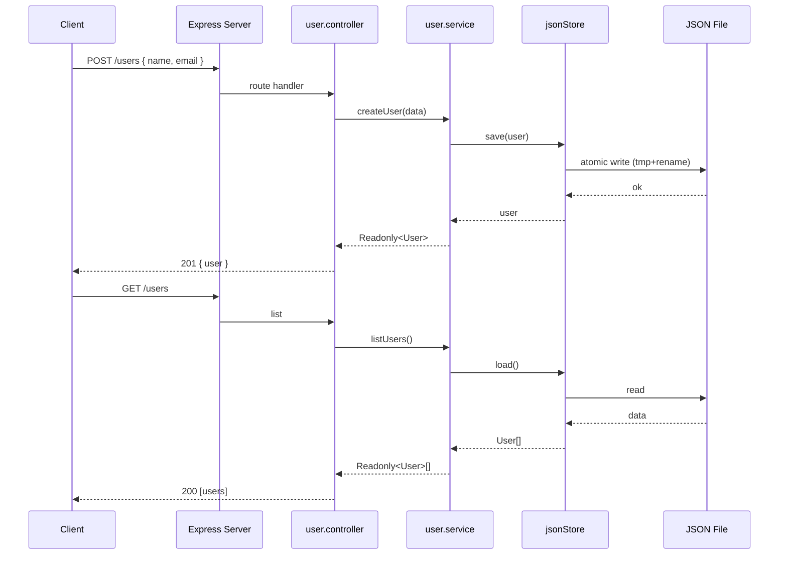

# NEETCODE — ts102: User Profile Manager

## N — Nature / Overview

A CRUD application for user profiles with both CLI and Express HTTP interfaces. Teaches: function typing, optional/readonly properties, interface merging, utility types (`Partial`, `Readonly`, `Record`, `Omit`).

**Role**: Introduces layering, persistence, and HTTP — moves beyond single-file CLI.

---

## E — Execution Flow (Sequence Diagram)



---

## E — Edge Cases

| Scenario | Handling |
|----------|----------|
| Missing required fields (name, email) | Returns 400 |
| Non-existent user ID | Returns 404 |
| Concurrent writes | JSON store has race conditions (noted limitation) |
| File corruption on write | Atomic write (tmp + rename) prevents partial writes |
| Missing data directory | `ensureFile()` creates directory + initial file |

---

## T — Type System & Complexity

**Type constructs**: `interface User` (readonly id, optional age), `Omit<>`, `Partial<>`, `Readonly<>`, `Record<>`

**Time complexity**:
- Create/Get/Update/Delete: O(1) — in-memory Map
- List: O(n)
- Persist: O(n) serialization

**Space complexity**: O(n) for n users

---

## C — Core Patterns (Design Patterns)

| Pattern | Usage |
|---------|-------|
| **Layered Architecture** | Service ↔ Persistence ↔ API |
| **Repository Pattern** | `JsonStore<T>` abstracts file I/O |
| **Dependency Injection** | Store injected into Service |
| **Service Layer** | `UserService` encapsulates business logic |
| **Atomic Write** | tmp + rename for crash-safe persistence |

---

## O — Optimization Notes

- In-memory Map is fast but not durable between restarts without periodic persist
- For production: swap JsonStore for SQLite/Postgres via Prisma
- Add Zod validation to replace manual field checks
- File-based store is single-process only

---

## D — Dependencies & Config

| Dependency | Version | Purpose |
|------------|---------|---------|
| express | ^4.18 | HTTP framework |
| uuid | ^9.0 | ID generation |
| TypeScript | ^5.9.3 | Compiler |
| Jest + ts-jest | 29.x | Testing |

---

## E — Evaluation / Testing

```
npm test    → CRUD lifecycle tests pass
npm start   → Express on :4000
npm run dev → Hot-reload dev server
```

**Test isolation**: Tests use OS temp directories with beforeEach/afterEach cleanup.
